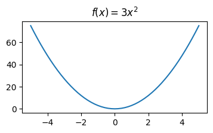

# 2headgrad

This is not your typical autograd engine implementation. It will be dirty. I will experiment here. I'll make a fool out of myself, but most importantly I will make you stop being afraid of making a fool out of yourself. Because while learning we are all fools, until it clicks and you go "OH MY GOD HOW COULD I EVER THOUGHT DIFFERENTLY!?". 

Enjoy.

### Derivatives and gradient

I'll try to be concise, but helpful. Not like math textbooks... Badum-tss. Whenever you have a function, it takes an $x$ and gives you some value $y$. A big chunk of functions (not all of them, but that's not important), changes these $y$ values smoothly. Take for example this function $f(x)=3x^2$.



Imagine you one day found yourself at some value of this function. And you want to go up, or down, but you're... blind, and you still want to go. You want to make a step, but you don't know whether it will go up or down when you take it, and you can hurt yourself. This is when you use a derivative. The derivative of a function tells you how fast (and in which direction), the values of the funnction change, when you make a step. 

So imagine again, you found yourself at $f(3)=81$, of the function above, blindfolded. You ask what is the value of this functions derivative at the $x=3$ that you stand at. An angel comes and tells you "oh it is $f'(3)=18$!", and now you know, that if you take a step to the right (derivative tells you how the function changes in the positive direction, if you want to go to the left — change the sign), you will find yourself 18 function value points higher. Damn, was that a big step. 

The definition of function's derivative is:

$$f'(x) = \lim_{h \to 0} \frac{f(x+h) - f(x)}{h}$$

Don't worry. It's not scarry. Look at it in parts. 

1. You want to check what happens with the function as it's argument grows a tiny bit $h$. So instead of the limit, you can just use a tini, tiny $h=0.000001$

2. The $f(x+h) - f(x)$ tells you how much the value grew when you took the tiny step $h$

3. The division by $h$ allows you to go back from the value change for the tini, tiny step to as if you took a step of $1$

See? That's not too bad. Also a python code for that:

```python
def derivative_value_at_x(f, x, h=0.00001):
    return (f(x + h) - f(x)) / h

derivative_value_at_x(f, 3)
```

Disclaimer: you shouldn't go too low with the $h$ value, cause it may cause problems with the result, due to overflow problems (read if you don't know what an overflow is). 

You can do the same with multivariable functions — the ones that have more than one argument, ie.: $f(x, y) = x^2 + y^2$. Then you just "freeze" one variable, and only add $h$ to the one you want to diagnose for speed of value change. This would represent moving up and down, but also left and right/forward and backward, or whatever else 2D movement you choose. 

$$\frac{\partial f(x, y)}{\partial x}  \approx \frac{f(x+h, y) - f(x,y)}{h}$$

This fancy thing in the beginning is just a way of saying that we take a derivative for only one of function's variables.


