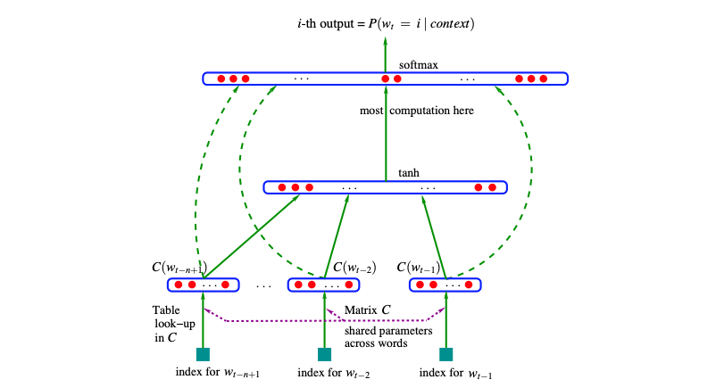
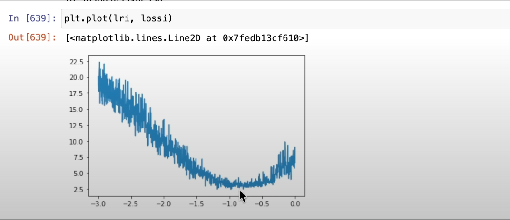

# 2headgrad

This is not your typical autograd engine implementation. It will be dirty. I will experiment here. I'll make a fool out of myself, but most importantly I will make you stop being afraid of making a fool out of yourself. Because while learning we are all fools, until it clicks and you go "OH MY GOD HOW COULD I EVER THOUGHT DIFFERENTLY!?". 

Enjoy.

### Derivatives and gradient

I'll try to be concise, but helpful. Not like math textbooks... Badum-tss. Whenever you have a function, it takes an $x$ and gives you some value $y$. A big chunk of functions (not all of them, but that's not important), changes these $y$ values smoothly. Take for example this function $f(x)=3x^2$.


Imagine you one day found yourself at some value of this function. And you want to go up, or down, but you're... blind, and you still want to go. You want to make a step, but you don't know whether it will go up or down when you take it, and you can hurt yourself. This is when you use a derivative. The derivative of a function tells you how fast (and in which direction), the values of the funnction change, when you make a step. 

So imagine again, you found yourself at $f(3)=81$, of the function above, blindfolded. You ask what is the value of this functions derivative at the $x=3$ that you stand at. An angel comes and tells you "oh it is $f'(3)=18$!", and now you know, that if you take a step to the right (derivative tells you how the function changes in the positive direction, if you want to go to the left — change the sign), you will find yourself 18 function value points higher. Damn, was that a big step. 

The definition of function's derivative is:

$$f'(x) = \lim_{h \to 0} \frac{f(x+h) - f(x)}{h}$$

Don't worry. It's not scarry. Look at it in parts. 

1. You want to check what happens with the function as it's argument grows a tiny bit $h$. So instead of the limit, you can just use a tini, tiny $h=0.000001$

2. The $f(x+h) - f(x)$ tells you how much the value grew when you took the tiny step $h$

3. The division by $h$ allows you to go back from the value change for the tini, tiny step to as if you took a step of $1$

See? That's not too bad. Also a python code for that:

```python
def derivative_value_at_x(f, x, h=0.00001):
    return (f(x + h) - f(x)) / h

derivative_value_at_x(f, 3)
```

Disclaimer: you shouldn't go too low with the $h$ value, cause it may cause problems with the result, due to overflow problems (read if you don't know what an overflow is). 

You can do the same with multivariable functions — the ones that have more than one argument, ie.: $f(x, y) = x^2 + y^2$. Then you just "freeze" one variable, and only add $h$ to the one you want to diagnose for speed of value change. This would represent moving up and down, but also left and right/forward and backward, or whatever else 2D movement you choose. 

$$\frac{\partial f(x, y)}{\partial x}  \approx \frac{f(x+h, y) - f(x,y)}{h}$$

This fancy thing in the beginning is just a way of saying that we take a derivative for only one of function's variables.

## Papers

### Bengio et al. 2003 — MLP model 

Bengio and the boys used embeddings (dimensions 30, 60, and 100 in the experiments), and a vocabulary of tokens of much bigger size (ie. 17000, used words as tokens), concatenated all of the embedded words, and put them through big MLP layer. Finishing with cross-entropy loss to predict the word following the ones that were feeded. 



I swear to god, the base requirement to publish novel science is doing the worst diagrams ever. Tbh I'd have no idea how to implement this. What are the dashed lines? I thought these are skip connections? Residuals? But no, apparently not. I still don't know what they are. 

The whole network (with characters as vocabulary) can be brought down to:

```python
# lets say batch size is 32, 3 characters per example
x = [[1, 22, 10], ...]      # [32, 3]
y = [5, 2...]               # [32,  ]

# linear layer embedding each character into 2 dimensional space
embeddings = torch.randn((27, 2))

x = embeddings[x]           # [32, 3, 2]

# linear layer (+ biases) projecting from 6 to 100
# 6 comes from the fact that each example is of length 3
# so 3 characters embedded in 2 dims gives [3, 2] vector
w1 = torch.randn((6, 100))
b1 = torch.randn(100)

x = x.view(-1, 6)           # [32, 6]
x = x @ w1 + b1             # [32, 100]

# tanh from the middle of the diagram
x = torch.tanh(x)

# final projection, downsizing output to vocabulary size
w2 = torch.randn(100, 27)
b2 = torch.randn(27)

x = x @ w2 + b2             # [32, 27]

# softmax to get probabilities per vocab element from logits
# here we get a distirbution over vocab that we can sample
# next token from 
# sum across dim=1 to get per batch element sum
# keepdim=True so broadcasting can work 
probabilities = x.exp() / x.exp().sum(dim=1, keepdim=True)


## long way to loss
# select probabilities for target token for each batch element
probabilities_per_target = probabilities[torch.arange(32), y]

# make it negative log likelihood, so can be used as a loss
neg_log_likelihood_loss = -1 * probabilities.log().mean()

## short way to loss
# use cross_entropy straight up 
loss = F.cross_entropy(x, y)
```

A good way of finding optimal learning rate is to look for upper and lower bound where loss explodes. These will serve as bounds between which we expect to find optimal learning rate. 

Now is the sick part. We can run a single training, changing the learning rate with each step, and choose the optimal learning rate based on the local minimum of learning rate losses. (Not sure why this work intuitively)



## Misc

### Initialization

Whenever we initialize a neural network, we can get a rough idea of the initial loss that we should observe. In case on NLP models, we base it on the size of vocabulary and loss function used. 

Let's say we use a vocabulary of size $|v|=27$. Remember that we finish with a distribution over the elements of this vocabulary, and we can assume that we should start with a uniform distribution — after all we have no idea which character/token has what probability. If we do that then each token would have probability of $\frac{1}{27}$. Then the negative log likelihood (cross-entropy) is $-\log\frac{1}{27}=3.2958$.

So we may think "hey, let's just set everything to zero, this way everything is uniform and there is no bias". But turns out this is not the greatest approach. Why?

- Every neuron would react the same way to the input and would produce the same gradient, leading to learning the same features, instead of capturing different ones, as we would hope they will. 

- If we choose the convention of ReLU thath sets the gradient for values equal zero to $0$. We would not get any gradient flow through it, as the gradient flow multiplcation would be `0 * out.grad = 0 `. 

- There is more situations like this, imagine that you pass only limit examples to $\tanh$, that results in it producing mainly $-1$ and $1$. Remember the gradient of $\tanh$? It is $(\tanh x)' = 1 - \tanh^2 x$, so if our weights are all zero, then inputs result in zeros being passed around the network, and gradient being squashed to $0$ as well. 

#### Kaiming initialization

Turns out if we aim to preseerve the variance of the activations, keeping the distribution tight, we get optimal initialization. Yeah, I don't like how this sounds either, cause I am a little unsure of why this helps. I see why this would work for normally distributed data, but not really in general. 

Kaiming init scales weights, dividing linear layer weight distributions, by $\frac{gain}{\sqrt in}$, which results in variance being kept unscaled between layers. More detail: https://pytorch.org/docs/stable/nn.init.html#torch.nn.init.kaiming_normal_

Gain is important, cause the combination of keeping variance in check and squashing functions like tanh or sigmoid drive the variance down in fact. So we need gain that corresponds to the function it follows so that the variance does not shrink.

#### Batch normalization

So Kaiming helped us keep the variance of the activations in check. But are there other methods? Could we just normalize the activations? We would force the variance (and/or mean) to be well behaved. I mean, normalizing is done with basic differentiable operations, so their combination is also differentiable... 

```python
x = (x - x.mean(0)) / x.std(0)
```

What happens if we just normalize the batch at each training step? Turns out it is not great, cause we only want this HARD normalization at model initialization. Later we are not sure what's best, maybe difusing the distribution or moving it around would be helpful? We have to give the model some wiggle room with this. 

```python
# we initialize the wiggle room so that it starts as identity
bngain = torch.ones(x.shape[1])
bnbias = torch.zeros(x.shape[1])

# we scale for each feature batch distribution -> dim=0
# keepdim=True to allow broadcasting
x = bngain * (x - x.mean(0, keepdim=True)) / x.std(0, keepdim=True) + bnbias
```

Noice... But wait! Notice that we just coupled our training batch size with model. That's not good. We would have to pass this batch size forever. And we may want to infer different size. 

The approach proposed in the paper is to take a mean and std of entire training set, and use it for inference on single examples. This could be done, by either calculating it on the whole set, or by a running mean. 

Other approach to decouple the model from the batch size is to use Layer Norm. Instead of looking for batch distribution per feature, we do that per batch element. 

```python
# we initialize the wiggle room so that it starts as identity
# looks weird to choose the feature dim shape, but we decouple
bngain = torch.ones(x.shape[1])
bnbias = torch.zeros(x.shape[1])

# we scale for each batch element distribution -> dim=1
x = bngain * (x - x.mean(1, keepdim=True)) / x.std(1, keepdim=True) + bnbias
```

Tip of the day: when using batch norm, it doesn't make sense to use biases in previous layer. It will get subtracted. 