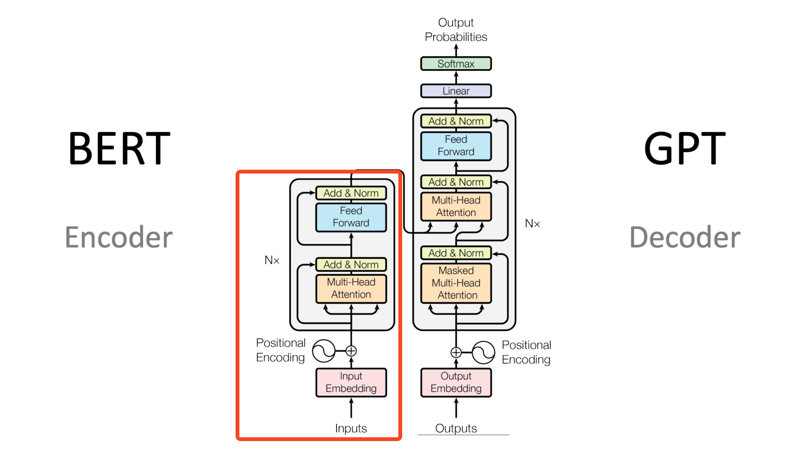
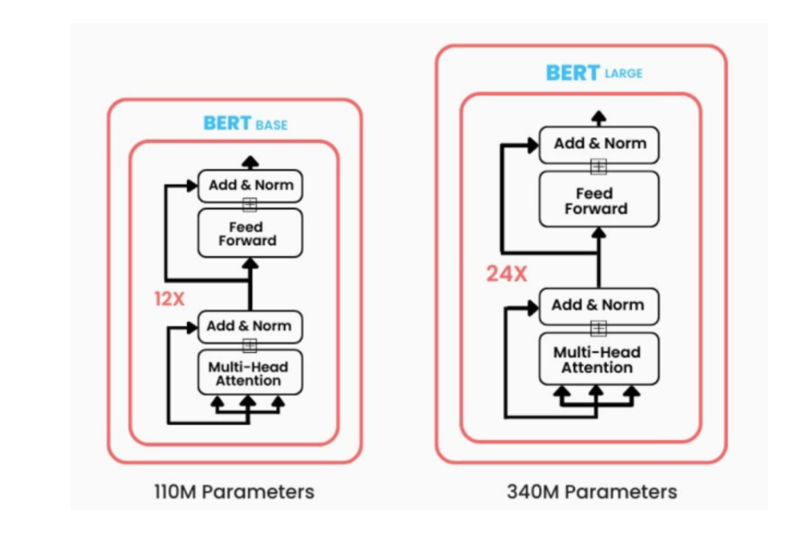
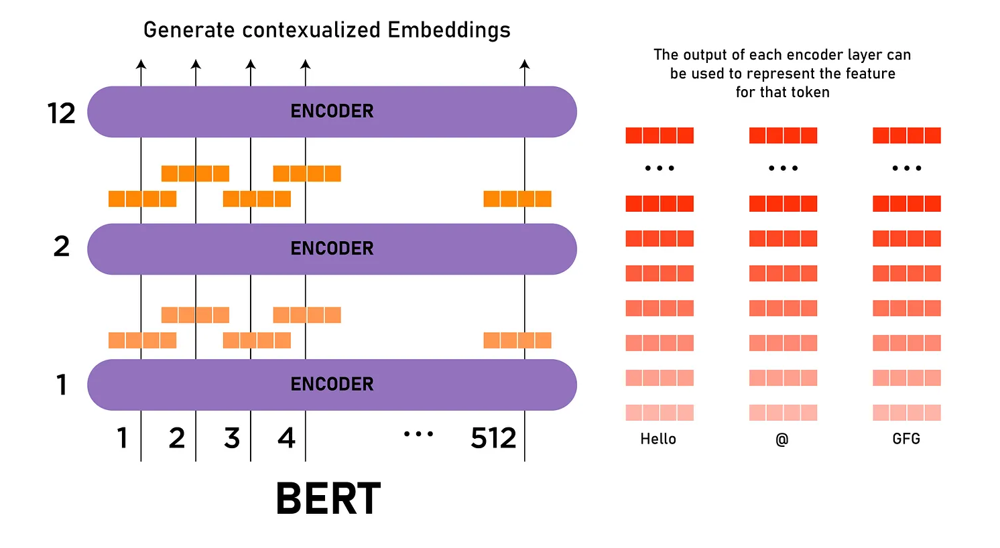
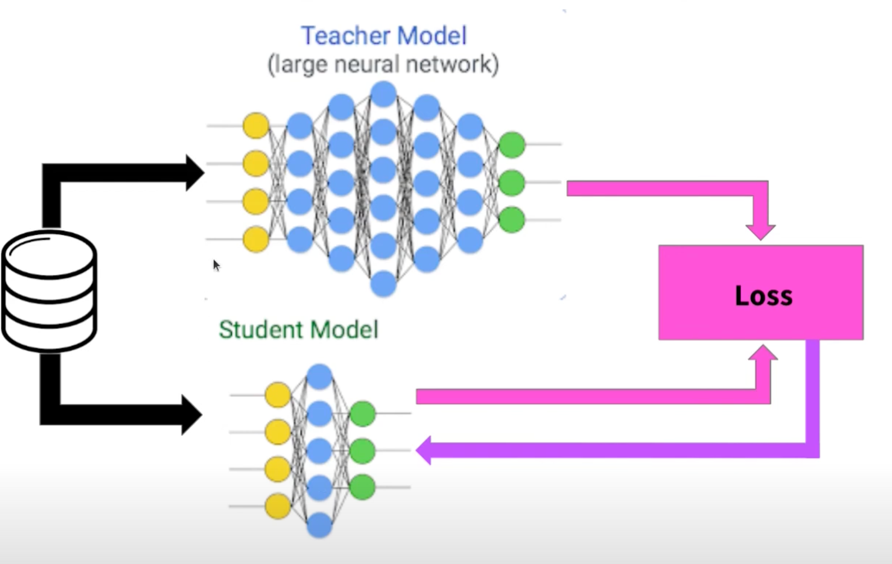
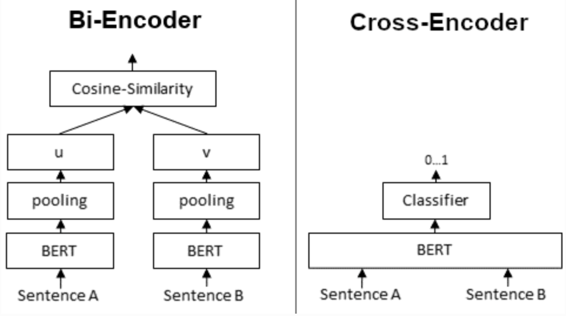
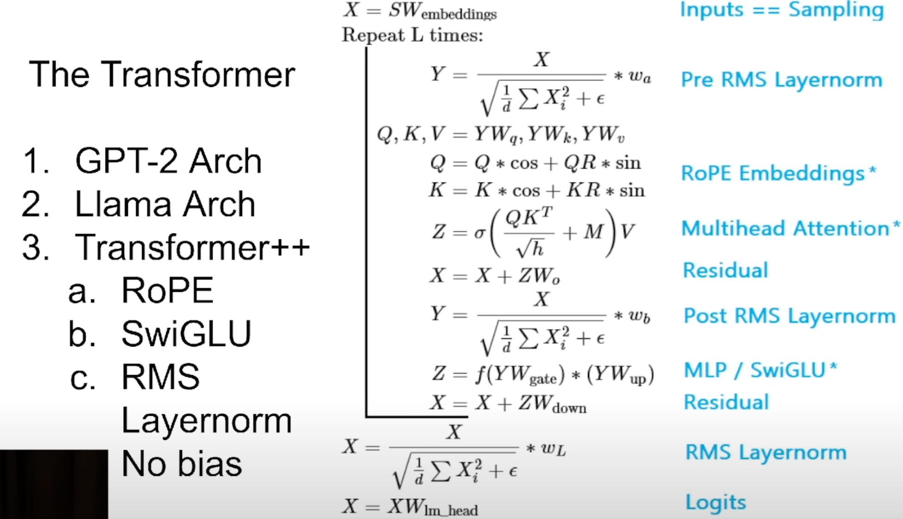

## Bert

I know it's BERT, not Bert. 

Bert is an encoder based model. Which means that when you see the big-ass transformer diagram, like the one below. Bert is the left part. 

As you can, it doesnt have a projection to vocabulary size at the end, nor the softmax producing probabilities for next token. So what does it do?

As we established in `attention.ipynb`, the difference between encoder and decoder blocks is that the latter can't see all of the tokens, it can see the future, as it's tasks is to PREDICT the next token, based on the ones preceeding it. 

Encoder on the other hand is meant to see the whole input, and give the best information possible about the whole thing, and how all tokens interact with each other. This is why encoder are used for embeddings. They're currently our best chance at representing inputs in some high dimensional space. So that we can build RAGs, cluster by similarity, or whatever we'd like to do knowing what inputs are similar to each other. 

Reminder: encoder vs decoder is distinguished intuitively by the above, but in practice, it's just that decoder has upper triangular part of attention matrix masked with zeros (-inf pre-softmax that yields zeros).

### Word embeddings

Starting with the simplest thing. You'd want to embedd a word, using the information from the whole input? How to do it? You put the input into Bert, and as each of the input tokens goes through more and more encoder blocks stacked on each other.

This image is pretty busy. What I want us to see is that each token passes through stacked on each other encoder blocks, and comes out of each having some more information about all other tokens embedded. Then on the right side the red gradient shows the "amount" of shared information that fills the tokens after each block. 

Now the word embedding is the simplest thing. Take the last vector corresponding to token you wanted embedded. Well, usually you take like the last one, and outputs of few previous encoders block to take a mean over them. This empirically yields better results. 

### Sentence embeddings — CLS Token

Inputs passed to Bert start with the CLS token. This token is used to capture the embedded meaning of the whole input, and in the Bert pretraining phase was used to drive the classification task. 

Therefore it is easy to see, that this token will contain a ton of information about the input. Why? 1. It has no "self-meaning" like other tokens do, 2. It had to perform well for the training classification task. 

In practice, when we want sentence embeddings we again don't take the last output for CLS, but either second to last (as it is less skewed to the classification task used in trainign), or mean of all outputs for CLS token. 

### Sentence embeddings — SentenceBERT

Involves an additional training step for Bert. The weights of the base model are cloned, and two sentences are passed through them. We calculate the similarity of the embedding vectors for both sentences (usually cosine similarity), and put this in the loss function, together with target similarity. Then the gradient is propagated with regard to both inputs. Great source: https://www.youtube.com/watch?v=lVqwznaVi78

We can again use different ways of capturing the embedding for sentence before the similarity calculation: CLS token, max over time for all otputs, mean of all outputs, whatever works. 

## RoBERTa vs BERT

Don't be scarred. Basically RoBERTa is upgraded BERT.

**Architecture**: same

**Pretraining objective**:
- BERT: Masked Language Modelling and Next Sentence Prediction
- RoBERTa: Masked Language Modelling, but dynamic, the masked words are chosen during training, no Next Sentence Prediction

**Tokenizer**: RoBERTa uses your general BPE tokenizer, while BERT uses wordpiece

### Misc

#### Distillation and DistilRoBERTa

Somewhat common knowledge is that a distilled model is a smaller version of some large model (in this case 125M -> 82M).

The basic explanation of how distillation works:

1. Put the input in the big model.
2. Get the probabilities of outputs from the big model (ie. probability per vocabulary token)
3. Put the same input in a small model.
4. Calculate cross-entropy loss between probabilities of small and big models.
5. Update the small model weights.

Distillation loss can also be calculated on weights, features, gradients, whatever you think will work best as "the knowledge" representation of the bigger model.

There is also a concept called online distillation. Two models learn at the same time with basic cross-entropy loss on targets. The twist is that we add a second term to the loss. This term is KL Divergence. We want to minimize the divergence between the probabilities from both models. Somehow this makes the models better lol.

You may hear knowledge transfer while reading about distillation — so far I only saw it used as fancier way of saying "finetuning".

Been pointed by giants to this twitter thread: https://x.com/giffmana/status/1806598836959215794

#### Cross-Encoder

Special case of similarity calculation using a Bert based model. Both sentences we want to compare, are passed together, separated with a SEP token. 

All the typical Bert operations (attention etc.), are done on the whole input together. 

Instead of embeddings, this model produces straight similarity of the input sentences, as a float number. For that there is a special head over the typical embedding outputs you'd see in SBert. 

#### Cross-Encoder vs Bi-Encoder (or Cross-Encoder + Bi-Encoder ?) — retrieve and re-rank

Bi-Encoder is basically putting the two sentences separately through the same Encoder model and calculating similarities at the end. It can't see the two sentences at the same time like cross-encoder does, so there is no information flow between them. But you also don't have to put all combinations of sentences to know similarities.

With Bi-encoder you can precompute the embeddings and just compare them whenever, which is way less costly.

But can these be used together? Turns out that Bi-Encoder even though hella efficient, performs worse in accuracy metrics than cross-encoder (no free meals there). But if we wanted to use Cross-encoder on everything the computation would outlive us. 

##### RAG retrieval and re-ranking

The way it's usually done is to first perform general RAG based retrieval, by calculating the cosine similarity between our query and embedded info, pulling some top number of results, and the using cross-encoder to calculate the more costly, but more accurate similarities using a cross-encoder. The second stage is called re-ranking

It's literally like a recruiting process. Low cost software takes some, idk, 100 candidates that put more buzzwords in their resume (bi-encoder embeddings), and then you put someone to actually review and interview each person (cross-encoder re-ranking).

Yeah, naming is stupid cause it's basically all the same with minor changes.

##### ColBERT

Embedd both query and document and calculate token-wise similarity(? probably didnt read too much into)

##### Embeddings Quantization

Embeddings are quantized to binary with a simple $x<0: 0, x > 0: 1$ function, and their similarity is calculated using Hamming distance — number of bit positions where they differ. They are usually used as a new retrieval + re-ranking first step, to get the early hits with minimal cost (~92% of float32 performance). Then higher precision embeddings (ie. int8) are used for re-ranking (~96% of float32 performance).

WHAT https://huggingface.co/blog/embedding-quantization

##### Transformer++

##### Matryoshka 

Forcing the model by loss that looks at similarities for series of truncated embeddings to learn how to put the most important context to front of the embedding vectors. 

---
Disclaimer: Images come from a variety of videos/blogs