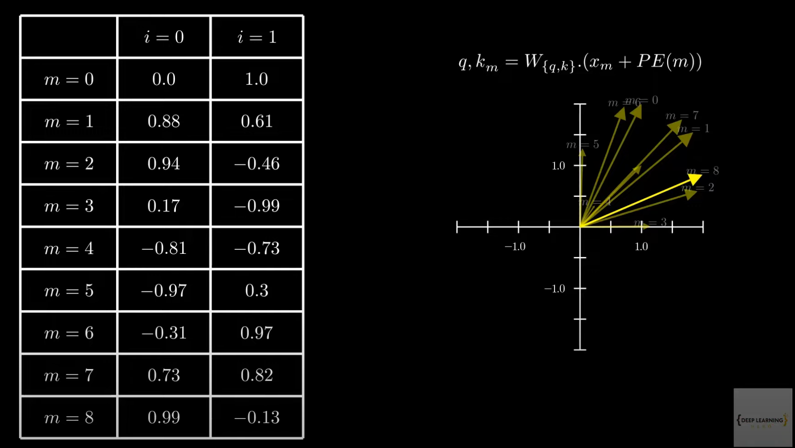
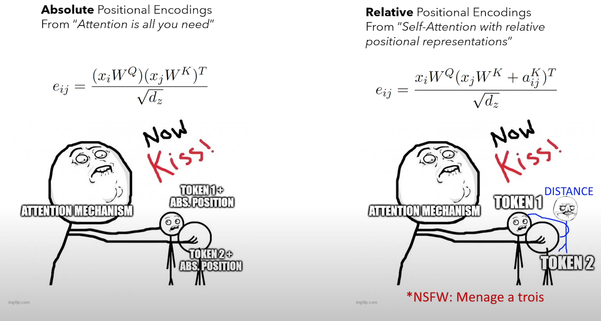

## Positional embeddings
All the ways we tell models which token is where.

### Absolute embeddings
Absolute embeddings are:
1. Unique by position
>If the model input length is 1024, then we are going to have constant, 1024 unique position embedding vectors.
2. Independent from tokens
>There is no relation between the token that is placed at certain position, and the position embedding vector. It's only the position that matters.

These vectors can be either learned or set by hand. No matter if they're learned or not, it's just going to be a matrix of size `input_length x token_embedding_space_dim`, that is added to token embeddings. 

If we set the absolute embeddings by hand, then the choice is arbitrary, but the original way it was done is with trigonometric embeddings. 

#### Sinusoidal absolute embeddings 

The set of position embedding vectors was created, by assigning values with the following formula:

- for even $i$:
  
  $$PE_{pos, i}=\sin(pos/10000^{2i/d_{model}})$$

- for odd $i$:

  $$PE_{pos, i}=\cos(pos/10000^{2i/d_{model}})$$

Where $pos$ is the position in sequence, $i$ is the current dimension of embedding space, $d_{model}$ is the overall dimensionality of embedding space. 

So each position vector looks like:

$$\mathbf{P_{pos}} = \begin{bmatrix} PE_{pos, 0} \\ PE_{pos, 1} \\ ... \end{bmatrix}$$

The intuitive way of seeing, why this might not be the best choice is, by looking at how these vectors span in space for subsequent positions $m$.

They seem pretty random right? We would expect to see some structured difference, some translation? Maybe some... rotation? (or let the model learn embeddings)

### Relative embeddings 

Relative embeddings are calculated for each two tokens at a time, when the attention is calculated (not really seeing it yet, writing and waiting for click, bear with me). Attention captures intensity of how two tokens are related to each other, relative positional encodings tell attention about the distance between the two words involved. Therefore given two tokens, we can create a vector representing the distance between them. 

So the relative position embeddings are not added until the computation of attention calculated them for each Query+Key pair, while absolute position embeddings, have the position information already baked in (added), before the attention happens. 

#### Rotary Position Embeddings

The idea was to find a generalized inner product, behaving like:

$$q_m^Tk_n = \langle f_g(x_m, m), f_k(x_n, n)\rangle = g(x_m, x_n, n-m)$$

Where:

$$q_m=f_q(x_q, m)$$
$$k_n=f_k(x_k, n)$$

Turns out that rotation is the answer to this problem. But to be honest it feels like they intuitively found rotation, checked it works, and then thought about the question. Cause the question has this theoritical tick to it, that makes me go "wait what do they ask for?". While rotation is a direct response to seemingly random distribution of subsequent position vectors we saw for absolute embeddings. But that's just a tangent.

I think I get it now. The most important part is: $f_{/{k, q/}}$ means that it applies to both functions $f_{k}$ and $f_{q}$. Also please take a look at section 3.4 in the original paper: https://arxiv.org/pdf/2104.09864, everything will be so much clearer, than with any youtube video on the topic. Trust me please. 

